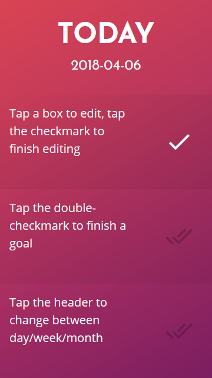

# 3goals
## PWA for setting three goals per day, week and month

Inspired by [a video by Tim Ruswick](https://www.youtube.com/watch?v=I0q2XnjDyZ0) I wanted to try to make a progressive web app for this very purpose.

You set three goals per day, per week and per month. The app should enable you to do just this, nothing more, nothing less.
Made with VanillaJS because there is enough npm bullshit out there.

## How to use

- Tap a box to edit, tap the checkmark to finish editing
- Tap the double-checkmark to finish a goal (and to toggle back if needed)
- Tap the header to change between day/week/month
- Get things done
